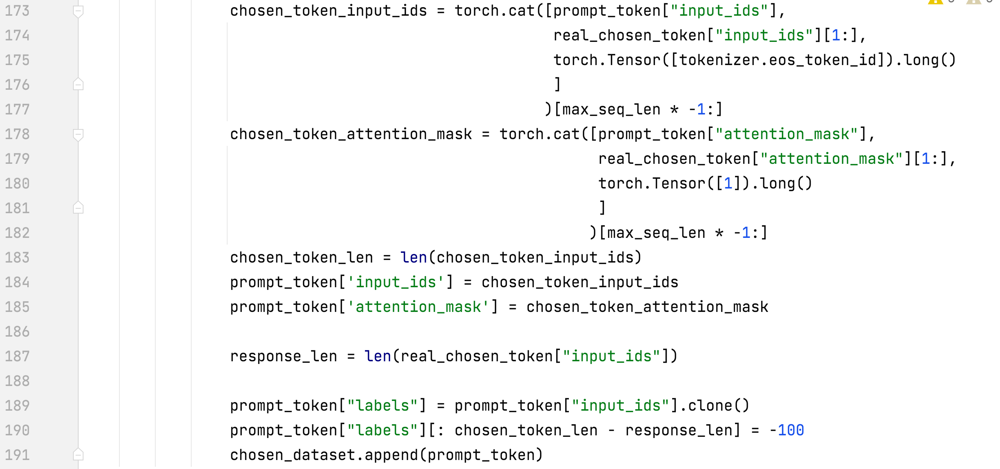
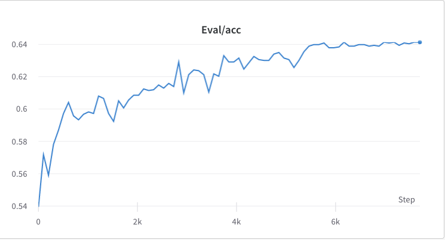
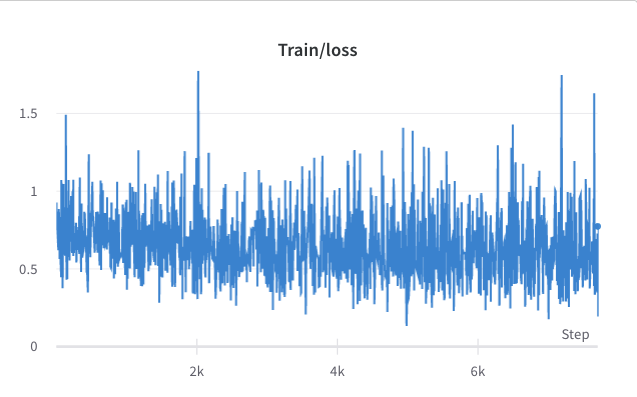
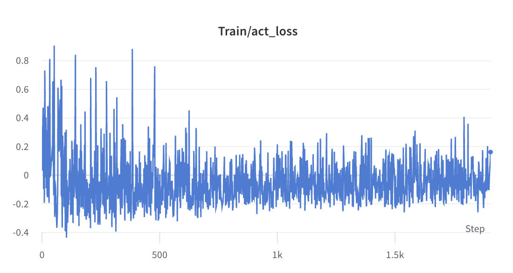
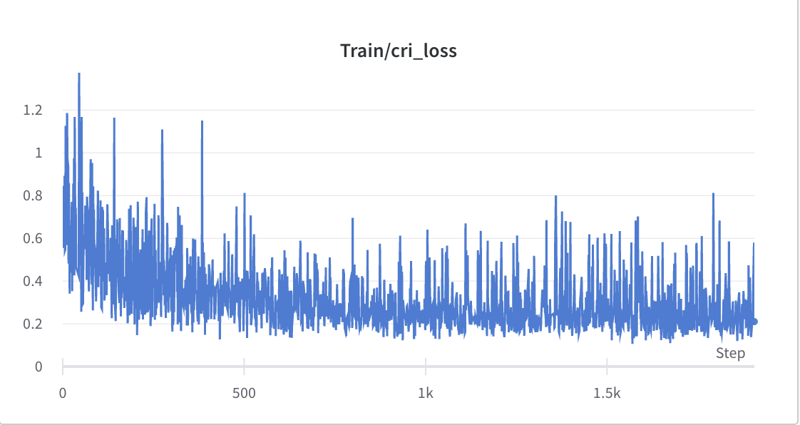
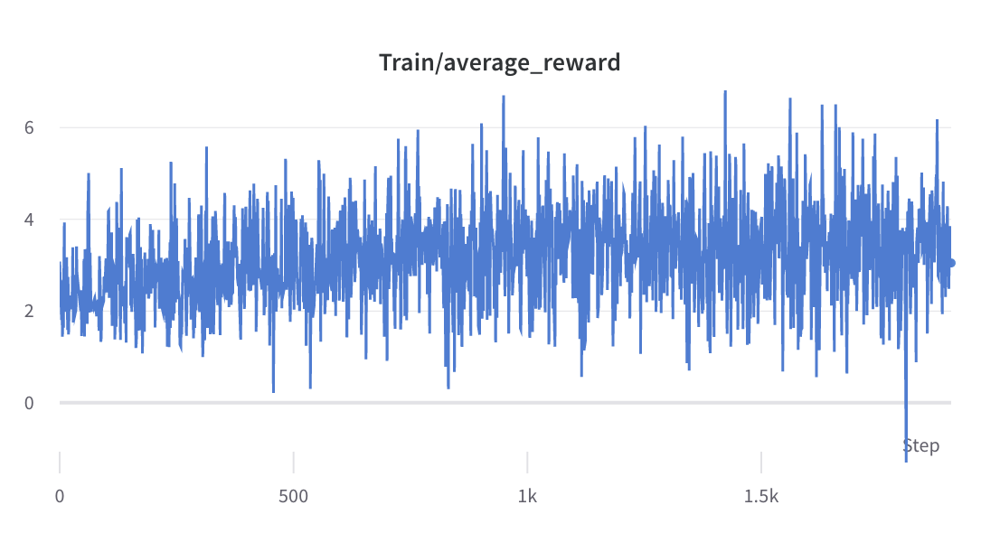
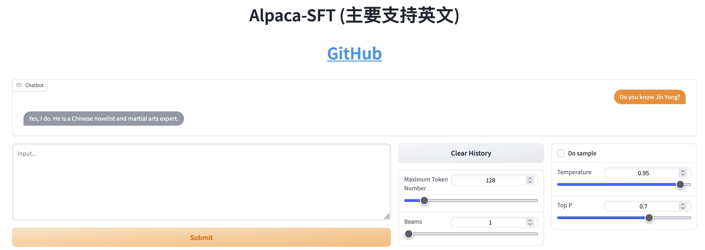
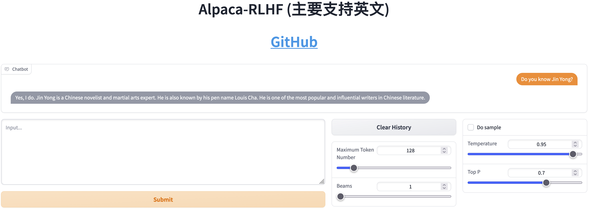
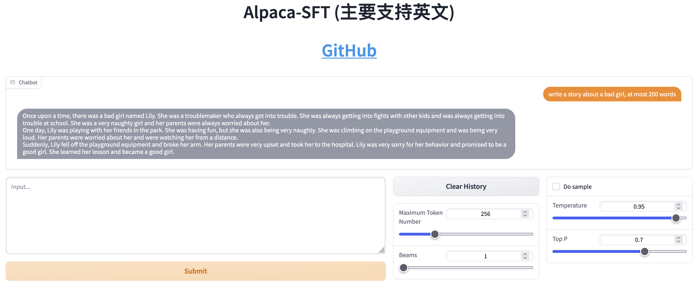
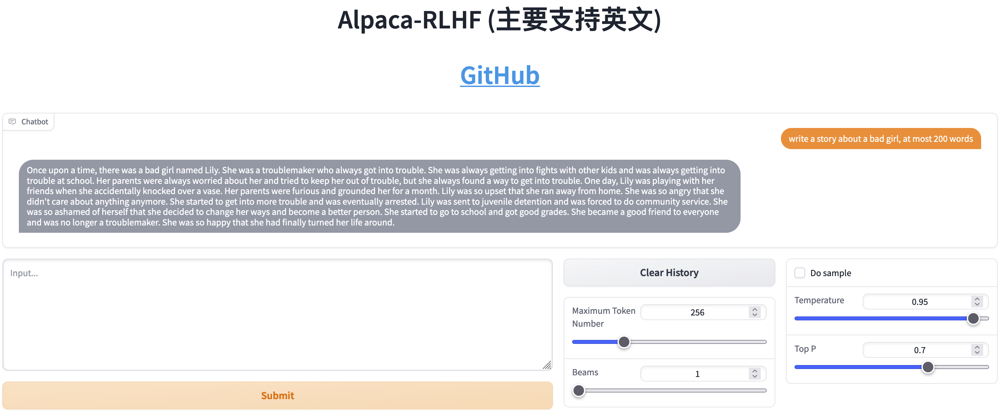

# alpaca-rlhf
Finetuning LLaMA with RLHF (Reinforcement Learning with Human Feedback).

## Online Demo
- [SFT](https://d03f7b0466275d4f9e.gradio.live/)
- [RLHF](https://88aeeb3aef5040507e.gradio.live/)

## Modifications on DeepSpeed Chat
### Step 1
- alpaca_rlhf/deepspeed_chat/training/step1_supervised_finetuning/main.py#main()
  - Set special tokens
    - 
- alpaca_rlhf/deepspeed_chat/training/utils/data/data_utils.py#create_dataset_split()
  - Train only on responses and add eos
    - 
  - Remove end_of_conversation_token
    - 
- alpaca_rlhf/deepspeed_chat/training/utils/data/data_utils.py#PromptDataset#__getitem__
  - Labels differs from input
    - 
- alpaca_rlhf/deepspeed_chat/training/utils/data/raw_datasets.py#MultiTurnAlpacaDataset
  - add MultiTurnAlpacaDataset
    - 
- alpaca_rlhf/deepspeed_chat/training/utils/module/lora.py#convert_linear_layer_to_lora
  - Support multiple module names for lora
    - 

### Step 2
- alpaca_rlhf/deepspeed_chat/training/step2_reward_model_finetuning/main.py#main()
  - Set special tokens
    - 
- alpaca_rlhf/deepspeed_chat/training/utils/model/reward_model.py#RewardModel#forward()
  - Fixing the numerical instability
    - 
- alpaca_rlhf/deepspeed_chat/training/utils/data/data_utils.py#create_dataset_split()
  - Remove end_of_conversation_token
    - 

### Step 3
- alpaca_rlhf/deepspeed_chat/training/step3_rlhf_finetuning/main.py#main()
  - Set special tokens
    - 
    - 
- alpaca_rlhf/deepspeed_chat/training/utils/data/data_utils.py#create_dataset_split()
  - Fix max length bug
    - 
- alpaca_rlhf/deepspeed_chat/training/utils/data/data_utils.py#DataCollatorRLHF#__call__
  - Fix pad_token_id bug
    - 
  - Fix padding side bug
    - 
- alpaca_rlhf/deepspeed_chat/training/step3_rlhf_finetuning/ppo_trainer.py#DeepSpeedPPOTrainer#generate_experience
  - Normalize reward
    - 
- alpaca_rlhf/deepspeed_chat/training/step3_rlhf_finetuning/ppo_trainer.py#DeepSpeedPPOTrainer#_generate_sequence
  - Mask the tokens after the eos
    - 

## Stey by Step
- Running all three steps on 2 x A100 80G
- Datasets
  - Dahoas/rm-static [huggingface](https://huggingface.co/datasets/Dahoas/rm-static) [paper](https://arxiv.org/abs/2204.05862) [GitHub](https://github.com/anthropics/hh-rlhf)
  - MultiTurnAlpaca
    - This is a multi-turn version of the alpaca dataset and is built based on [AlpacaDataCleaned](https://github.com/gururise/AlpacaDataCleaned) and [ChatAlpaca](https://github.com/cascip/ChatAlpaca).
- Enter ./alpaca_rlhf directory first, then run the following commands:
    - step1: sh run.sh --num_gpus 2 /tmp/pycharm_project_227/alpaca_rlhf/deepspeed_chat/training/step1_supervised_finetuning/main.py --sft_only_data_path MultiTurnAlpaca --data_output_path /root/autodl-tmp/rlhf/tmp/ --model_name_or_path decapoda-research/llama-7b-hf --per_device_train_batch_size 8 --per_device_eval_batch_size 8 --max_seq_len 512 --learning_rate 3e-4 --num_train_epochs 1 --gradient_accumulation_steps 8 --num_warmup_steps 100 --output_dir /root/autodl-tmp/rlhf/actor --lora_dim 8 --lora_module_name q_proj,k_proj --only_optimize_lora --deepspeed --zero_stage 2
      - when --sft_only_data_path MultiTurnAlpaca is added, please unzip data/data.zip first. 
    - step2: sh run.sh --num_gpus 2 /tmp/pycharm_project_227/alpaca_rlhf/deepspeed_chat/training/step2_reward_model_finetuning/main.py --data_output_path /root/autodl-tmp/rlhf/tmp/ --model_name_or_path decapoda-research/llama-7b-hf --num_padding_at_beginning 0 --per_device_train_batch_size 4 --per_device_eval_batch_size 64 --learning_rate 5e-4 --num_train_epochs 1 --gradient_accumulation_steps 1 --num_warmup_steps 0 --zero_stage 2 --deepspeed --output_dir /root/autodl-tmp/rlhf/critic --lora_dim 8 --lora_module_name q_proj,k_proj --only_optimize_lora
      - the training process of step 2
        - 
        - 
        - 
        - 
      - The mean and standard deviation of the reward of the chosen responses are collected and used to normalize the reward in step 3. In one experiment, they are -0.8677118420600891 and 0.2210693359375 respectively and are used in the alpaca_rlhf/deepspeed_chat/training/step3_rlhf_finetuning/ppo_trainer.py#DeepSpeedPPOTrainer#generate_experience methods: 'rewards': (reward_score - (-0.8677118420600891)) / 0.2210693359375.
        - 
    - step3: sh run.sh --num_gpus 2 /tmp/pycharm_project_227/alpaca_rlhf/deepspeed_chat/training/step3_rlhf_finetuning/main.py --data_output_path /root/autodl-tmp/rlhf/tmp/ --actor_model_name_or_path /root/autodl-tmp/rlhf/actor/ --tokenizer_name_or_path decapoda-research/llama-7b-hf --critic_model_name_or_path /root/autodl-tmp/rlhf/critic --actor_zero_stage 2 --critic_zero_stage 2 --num_padding_at_beginning 0 --per_device_train_batch_size 4 --per_device_mini_train_batch_size 4 --ppo_epochs 2 --actor_learning_rate 9.65e-6 --critic_learning_rate 5e-6 --gradient_accumulation_steps 1 --deepspeed --actor_lora_dim 8 --actor_lora_module_name q_proj --critic_lora_dim 8 --critic_lora_module_name q_proj,k_proj --only_optimize_lora --output_dir /root/autodl-tmp/rlhf/final
      - the training process of step 3
        - 
        - 
        - 
- Inference
  - nohup sh run_inference.sh 0 alpaca_rlhf/inference/llama_chatbot_gradio.py --path /root/autodl-tmp/rlhf/final/actor > rlhf_inference.log 2>&1 &
  - nohup sh run_inference.sh 0 alpaca_rlhf/inference/llama_chatbot_gradio.py --path /root/autodl-tmp/rlhf/actor > sft_inference.log 2>&1 &

## Comparison between SFT and RLHF
- Chat
  - SFT
    - 
  - RLHF
    - 
- Write stories
  - SFT
    - 
  - RLHF
    - 

## References

### Articles
- [如何正确复现 Instruct GPT / RLHF?](https://zhuanlan.zhihu.com/p/622134699)
- [影响PPO算法性能的10个关键技巧（附PPO算法简洁Pytorch实现）](https://zhuanlan.zhihu.com/p/512327050)

### Sources
- [Awesome RLHF](https://github.com/opendilab/awesome-RLHF)

### Tools
- [DeepSpeed-Chat](https://github.com/microsoft/DeepSpeedExamples/tree/master/applications/DeepSpeed-Chat)

### Datasets
- [Stanford Human Preferences Dataset (SHP)](https://huggingface.co/datasets/stanfordnlp/SHP)
- [HH-RLHF](https://huggingface.co/datasets/Anthropic/hh-rlhf)
  - [hh-rlhf](https://github.com/anthropics/hh-rlhf)
    - Training a Helpful and Harmless Assistant with Reinforcement Learning from Human Feedback [[paper](https://arxiv.org/abs/2204.05862)]
    - [Dahoas/static-hh](https://huggingface.co/datasets/Dahoas/static-hh)
    - [Dahoas/rm-static](https://huggingface.co/datasets/Dahoas/rm-static)
- GPT-4-LLM
  - [GitHub](https://github.com/Instruction-Tuning-with-GPT-4/GPT-4-LLM)
  - [Paper](https://arxiv.org/pdf/2304.03277.pdf)
  - [Site](https://instruction-tuning-with-gpt-4.github.io/)
- Open-Assistant
  - [Site](https://open-assistant.io/zh)
  - [GitHub](https://github.com/LAION-AI/Open-Assistant)
  - [Paper](./papers/2023-OpenAssistant%20Conversations%20-%20Democratizing%20Large%20Language%20Model%20Alignment.pdf)

### Related Repositories
- [my-alpaca](https://github.com/l294265421/my-alpaca)
- [multi-turn-alpaca](https://github.com/l294265421/multi-turn-alpaca)
